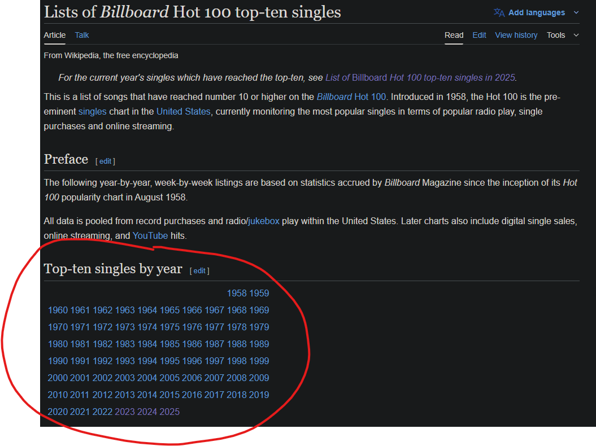

# [Billboard Top Ten Analysis (1958 - 2025)](https://ghpguy.github.io/wiki_popular_music/quarto.html)

_Author: Paul Harris_

---


## Project Overview

This project analyzes the Billboard Hot 100 Top Ten singles from 1958 to 2025. Using data scraped from Wikipedia, it explores trends in song longevity, peak chart positions, artist performance, seasonality, and collaboration networks. The analysis is performed in Python and visualized with Plotly, with a reproducible report generated using Quarto. Take a look at the [full report here](https://ghpguy.github.io/wiki_popular_music/quarto.html).


## Features
- Data scraping from Wikipedia for Billboard Hot 100 Top Ten singles
- Data cleaning and preprocessing
- Exploratory data analysis and visualization
- Survival analysis of song longevity
- Clustering of song trajectories
- Artist collaboration network analysis
- Reproducible Quarto report

## Project Structure
```
wiki_popular_music/
├── data/                  # Billboard data CSVs
├── notebooks/             # Jupyter notebooks for analysis
├── utils/                 # Data scraping and helper scripts
├── quarto.qmd             # Main Quarto report
├── README.md              # Project documentation
└── ...
```

## How to Reproduce
1. Clone the repository.
2. Install Python dependencies (see below).
3. Run the data scraping script in `utils/get_data.py` to fetch the latest data, or use the provided CSV in `data/`.
4. Render the Quarto report:
   ```sh
   quarto render quarto.qmd
   ```

## Requirements
- Python 3.8+
- pandas, numpy, plotly, lifelines, scikit-learn, networkx, beautifulsoup4, requests, quarto

Install dependencies with:
```sh
pip install -r requirements.txt
```

## Data Source
- [Wikipedia: Lists of Billboard Hot 100 top-ten singles](https://en.wikipedia.org/wiki/Lists_of_Billboard_Hot_100_top-ten_singles)



## License
MIT License

---


